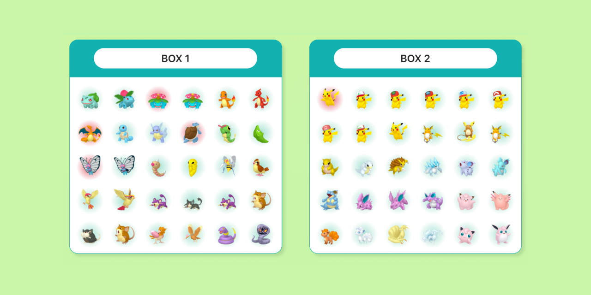

# Pokémon Living Dex

🏠 [itsjavi.com/livingdex](https://itsjavi.com/livingdex)

Living Dex is a visual guide for organizing Pokémon HOME boxes. 
This web app contains a view of all storable Pokémon forms, including all gender differences.

> 🥚 This project is still in an **early state**, please feel free to join our discussion and share your thoughts
> in the [Github project's discussion](https://github.com/itsjavi/livingdex/discussions) section.

> 💡 The big milestones for this project are to add edition and **customization options** 
> as well as a **full-featured Pokédex**.

## Credits

👨🏻‍💻 Created by [**@itsjavi**](https://itsjavi.com) aka. [**@route1rodent**](https://twitter.com/route1rodent)

## License

This software is copyrighted and licensed under the
[MIT license](https://github.com/itsjavi/livingdex/LICENSE).

### Disclaimer

This software comes bundled with data and graphics extracted from the
Pokémon series of video games. Some terminology from the Pokémon franchise is
also necessarily used within the software itself. This is all the intellectual
property of Nintendo, Creatures, inc., and GAME FREAK, inc. and is protected by
various copyrights and trademarks.

The authors believe that the use of this intellectual property for a fan reference
is covered by fair use and that the software is significantly impaired without said
property included. Any use of this copyrighted property is at your own legal risk.

This software is not affiliated in any way with Nintendo,
Pokémon or any other game company.

A complete revision history of this software is available in Github
[https://github.com/itsjavi/livingdex](https://github.com/itsjavi/livingdex)
